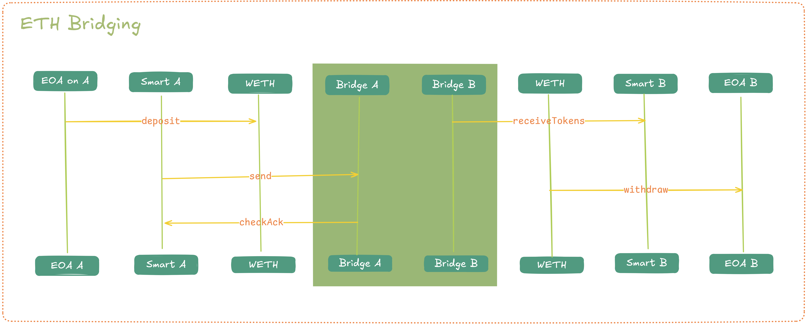
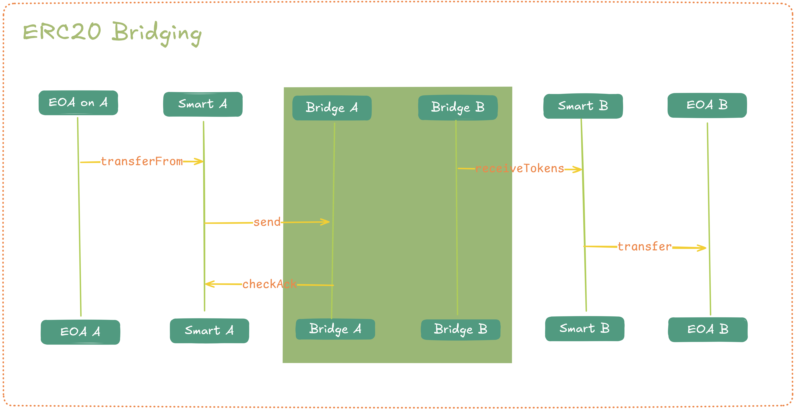

<div align="center">
  
</div>

## What is Compose Network?

Compose is a first-of-its-kind Shared Publisher. Compose extends Ethereum validators' functionality to enable synchronous composability across rollups, so multi-chain actions feel like one transaction and one chain.

### What is the Shared Publisher?

The SP (Shared Publisher) is a validator-powered coordination layer that coordinates multi-chain transactions via 2PC, aggregates cross-rollup bundles, verifies them (with ZK), and publishes a single “superblock” to L1 via L1 validators. Sequencers keep sovereignty, and the SP makes the result atomic and synchronous across chains.

### How does Compose work?

Compose coordinates cross-rollup transactions using a standardized Mailbox system that gives every rollup an inbox and outbox for exchanging messages. When a transaction spans multiple rollups, each sequencer simulates its local part and records any cross-chain calls as Mailbox writes. These messages are automatically sent to the target rollup’s sequencer, which inserts them into its inbox (via Mailbox.addMessage) before executing its corresponding logic. 

Once all messages are exchanged, each sequencer validates its part and sends a “vote” through the Shared Publisher’s two-phase commit (2PC) protocol. If all report success, the Shared Publisher aggregates the rollup blocks into a single superblock and publishes it to Ethereum L1; if any fail, the entire bundle is rolled back. Aggregated ZK proofs confirm that everything executed correctly before final settlement on Ethereum.

## What this demo showcases

This demo is a web app that highlights Compose Network's synchronous composability across two rollups.

In this demo the user can:
- Bridge ETH from Hoodi to either Rollup A or Rollup B
- Bridge ERC-20 tokens between rollups (burns on one side, mints on the other)
- Execute atomic cross-rollup swaps and same-rollup swaps between SSV, ETH, and USDC on Rollup A and Rollup B

### Prerequisites
- Two composed rollups: Rollup A and Rollup B
- Deployed contracts on each rollup:
  - Mailbox and Bridge contracts (see contracts docs: https://docs.compose.network/developers/smart-contracts/)
  - ERC-20 tokens deployed with burn and mint functions to enable bridging
  - Swap contract
- Smart account infrastructure (ZeroDev Kernel + ECDSA validator)

For this specific demo, these networks/contracts are already deployed and ready to use.

### End-to-End Transaction Flow
1. **Account Setup**: Creates ZeroDev Kernel accounts and ECDSA validators on source and destination chains
2. **Allowance Management**: Verifies and sets ERC-20 allowances to bridge contracts
3. **Generate contract calls data**: Generate call data for ERC-20 allowances, ERC-20 bridging, and swap transactions
4. **Bundle calls in UserOperations**: Builds UserOperations containing the contract calls with their parameters
5. **Get transactions to handle UserOps**: Send the prepared UserOperations to the respective chain's sequencer custom RPC method `compose_buildSignedUserOpsTx`. The sequencer will act as an Account Abstraction Bundler and generate a transaction to the EntryPoint contract's `handleOps` method, to process the UserOperation
6. **Cross-chain transaction**: Submits all of the transactions together using `eth_sendXTransaction` and returns the transaction hashes

For more details, please look at the [official documentation](https://docs.compose.network/developers/getting-started/composable-dapps).


### Swap Flow

<div align="center">
  
</div>

### Bridge Diagrams

#### ETH Bridging

<div align="center">
  
</div>

#### ERC-20 Bridging

<div align="center">
  
</div>

### Technical Architecture
- **Frontend**: React + TypeScript + Vite
- **Blockchain Integration**: Wagmi + Viem for Ethereum interactions
- **Smart Accounts**: ZeroDev Kernel accounts with ECDSA validation
- **UI Components**: Radix UI + Tailwind CSS

## Quick Start

### Prerequisites
- Node.js >= 18.0.0
- pnpm >= 8.0.0

### Installation & Development

```bash
# Install dependencies
pnpm install

# Start development server
pnpm run dev
```

## Supported Networks

- **Hoodi Testnet**: Ethereum Layer 1 testnet for initial ETH deposits
- **Rollup A**: Compose demo rollup showcasing synchronous composability
- **Rollup B**: Second Compose demo rollup for cross-chain operations

## Supported Tokens

- **ETH**
- **SSV**
- **USDC**

## Learn More

- **[Compose Network Documentation](https://docs.compose.network)**
- **[Composable dApps Overview + code walkthrough](https://docs.compose.network/developers/getting-started/composable-dapps)** - Understanding the transaction flow
- **[ZeroDev Documentation](https://docs.zerodev.app)** - Smart account infrastructure

## Contributing

This is a demonstration application showcasing Compose Network capabilities. For questions about Compose Network or to contribute to the protocol, please visit the [official documentation](https://docs.compose.network).
