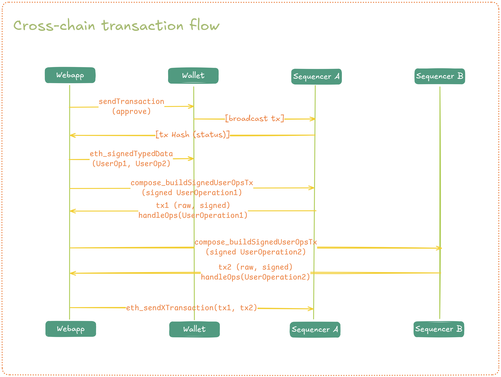

<div align="center">
  
</div>

## What is Compose Network?

Compose Network unites Ethereum rollups to enable instant and composable transactions, where actions across rollups can happen together in a single atomic transaction. It's powered by a Shared Publisher, a coordination layer that allows rollups to execute operations synchronously while each maintains its own sequencing and independence.

## What this demo showcases

This demo is a web app that highlights Compose Network's synchronous composability across two rollups.

In this demo the user can:
- Bridge ETH from Hoodi to either Rollup A or Rollup B
- Bridge ERC-20 tokens between rollups (burns on one side, mints on the other)
- Execute atomic cross-rollup swaps and same-rollup swaps between SSV, ETH, and USDC on Rollup A and Rollup B

### Prerequisites
- Two composed rollups: Rollup A and Rollup B (plus Hoodi testnet (L1) for bridging)
- Deployed core contracts on each rollup:
  - Mailbox and Bridge contracts (see contracts docs: https://docs.compose.network/developers/smart-contracts/)
  - Swap contract for token routing and settlement (see docs: https://docs.compose.network)
- Smart account infrastructure (ZeroDev Kernel + ECDSA validator)

For this specific demo, these contracts are already deployed and ready to use.

## How It Works

This demo implements the core Compose Network transaction flow:

### End-to-End Transaction Flow
1. **Account Setup**: Creates ZeroDev Kernel accounts and ECDSA validators on source and destination chains
2. **Allowance Management**: Verifies and sets ERC-20 allowances to bridge contracts
3. **Generate transactions**: Generate transaction data for ERC-20 allowances, ERC-20 bridging, and swap transactions
3. **UserOperation Preparation**: Builds and signs UserOperations for both chains using `compose_buildSignedUserOpsTx` based off of the transaction data
4. **Cross-chain Settlement**: Submits all of the transactions together using `eth_sendXTransaction` and returns the transaction hashes

### Swap Diagram

<div align="center">
  
</div>

### ERC-20 Bridge Diagram

<div align="center">
  
</div>

### Technical Architecture
- **Frontend**: React + TypeScript + Vite
- **Blockchain Integration**: Wagmi + Viem for Ethereum interactions
- **Smart Accounts**: ZeroDev Kernel accounts with ECDSA validation
- **UI Components**: Radix UI + Tailwind CSS

## Quick Start

### Prerequisites
- Node.js >= 18.0.0
- pnpm >= 8.0.0

### Installation & Development

```bash
# Install dependencies
pnpm install

# Start development server
pnpm run dev
```

## Supported Networks

- **Hoodi Testnet**: Ethereum Layer 1 testnet for initial ETH deposits
- **Rollup A**: Compose demo rollup showcasing synchronous composability
- **Rollup B**: Second Compose demo rollup for cross-chain operations

## Supported Tokens

- **ETH**: Native Ethereum token
- **SSV**: Secret Shared Validators token
- **USDC**: USD Coin stablecoin

## Learn More

- **[Compose Network Documentation](https://docs.compose.network)**
- **[Composable dApps Overview + code walkthrough](https://docs.compose.network/developers/getting-started/composable-dapps)** - Understanding the transaction flow
- **[ZeroDev Documentation](https://docs.zerodev.app)** - Smart account infrastructure

## Contributing

This is a demonstration application showcasing Compose Network capabilities. For questions about Compose Network or to contribute to the protocol, please visit the [official documentation](https://docs.compose.network).